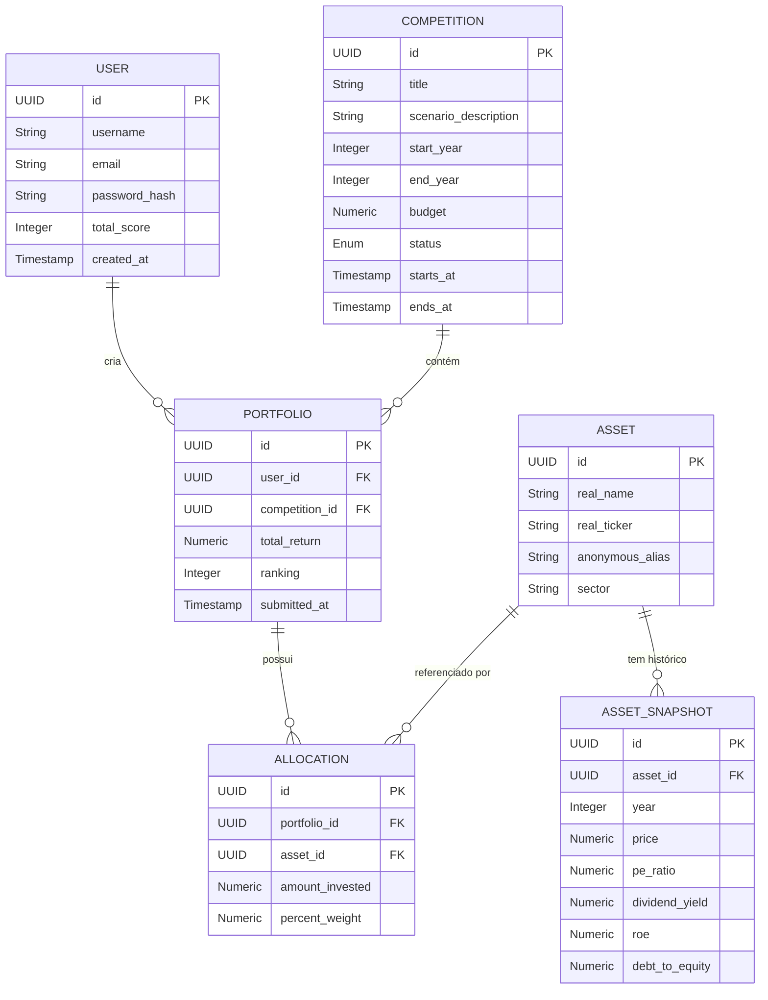
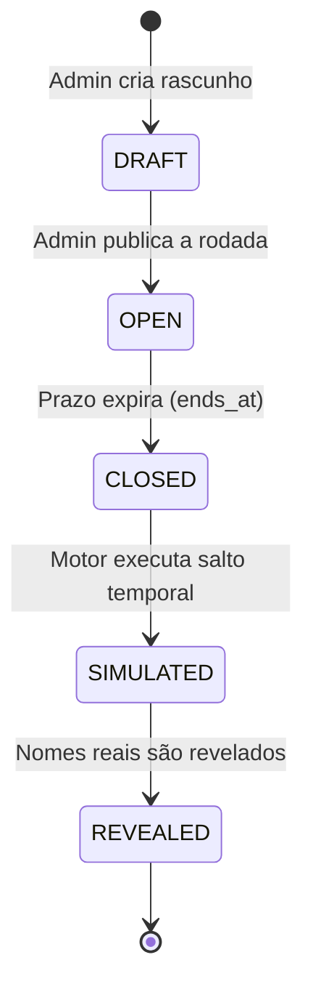
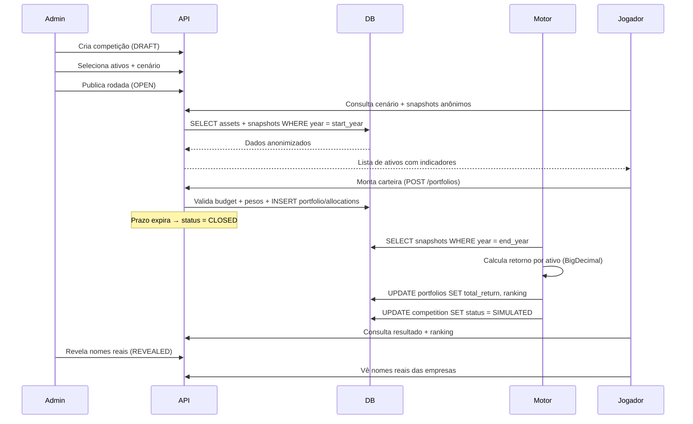

# RetroBolsa — Modelo de Dados

Documentação técnica completa das entidades, relacionamentos e regras de negócio do banco de dados.

---

## Visão Geral

O modelo é composto por **6 entidades principais** e **1 entidade secundária**, organizadas em torno de um fluxo central:

> Usuário → entra em uma Competição → monta um Portfólio → aloca em Ativos anonimizados → Motor simula → Ranking é gerado



---

## 1. `users` — Usuários

### Propósito
Representa cada jogador registrado na plataforma. Armazena credenciais para autenticação JWT e a pontuação acumulada ao longo de todas as rodadas.

### Estrutura da Tabela

| Coluna | Tipo | Constraints | Descrição |
|---|---|---|---|
| `id` | `UUID` | `PK`, `DEFAULT gen_random_uuid()` | Identificador único. UUID evita IDs sequenciais previsíveis e facilita merge de dados entre ambientes. |
| `username` | `VARCHAR(50)` | `NOT NULL`, `UNIQUE` | Nome de exibição público do jogador. Único para evitar ambiguidade nos rankings. |
| `email` | `VARCHAR(255)` | `NOT NULL`, `UNIQUE` | Usado para login e recuperação de senha. Validado no backend com `@Email`. |
| `password_hash` | `VARCHAR(255)` | `NOT NULL` | Hash BCrypt da senha. **Nunca** armazenamos a senha em texto puro. O Spring Security usa `BCryptPasswordEncoder` por padrão. |
| `total_score` | `INTEGER` | `NOT NULL`, `DEFAULT 0` | Pontuação acumulada do jogador. Atualizada pelo `RankingService` ao final de cada rodada. Permite ranking global "all-time". |
| `created_at` | `TIMESTAMP` | `NOT NULL`, `DEFAULT NOW()` | Data de registro. Útil para métricas e para exibir "membro desde". |

### Regras de Negócio
- Um usuário pode participar de **múltiplas competições simultaneamente**.
- O `total_score` é a soma dos pontos ganhos em cada rodada (ex.: 1º lugar = 100pts, 2º = 90pts, etc.).
- A exclusão de um usuário deve ser **soft delete** (adicionar coluna `deleted_at` futuramente) para preservar integridade dos rankings históricos.

### SQL de Criação
```sql
CREATE TABLE users (
    id              UUID PRIMARY KEY DEFAULT gen_random_uuid(),
    username        VARCHAR(50)  NOT NULL UNIQUE,
    email           VARCHAR(255) NOT NULL UNIQUE,
    password_hash   VARCHAR(255) NOT NULL,
    total_score     INTEGER      NOT NULL DEFAULT 0,
    created_at      TIMESTAMP    NOT NULL DEFAULT NOW()
);
```

---

## 2. `assets` — Ativos Financeiros

### Propósito
Representa um ativo financeiro real (ação, título público, fundo imobiliário) cadastrado na base. Cada ativo possui seu **nome real** (revelado apenas ao final da rodada) e um **alias anônimo** que é o que o jogador vê durante a competição.

### Estrutura da Tabela

| Coluna | Tipo | Constraints | Descrição |
|---|---|---|---|
| `id` | `UUID` | `PK`, `DEFAULT gen_random_uuid()` | Identificador único do ativo. |
| `real_name` | `VARCHAR(100)` | `NOT NULL` | Nome real da empresa/título. Ex.: "Petrobras", "Tesouro IPCA+ 2035". Revelado somente após o encerramento da rodada. |
| `real_ticker` | `VARCHAR(20)` | `NOT NULL`, `UNIQUE` | Código de negociação real. Ex.: "PETR4", "WEGE3". Garantido único pois cada ticker mapeia para exatamente um ativo na bolsa. |
| `anonymous_alias` | `VARCHAR(50)` | `NOT NULL` | Codinome exibido ao jogador. Ex.: "Empresa Alfa", "Título Gama-7". Gerado automaticamente pelo `AssetService`. **Não precisa ser único globalmente** pois pode ser reutilizado entre rodadas diferentes. |
| `sector` | `VARCHAR(50)` | `NOT NULL` | Setor econômico. Ex.: "Energia", "Tecnologia", "Renda Fixa". Exibido ao jogador para auxiliar na diversificação, mas sem revelar a identidade do ativo. |

### Mecanismo de Anonimização

> [!IMPORTANT]
> A anonimização é o **pilar central** da gamificação. O jogador nunca deve poder deduzir qual empresa está por trás de um alias. 

O sistema garante isso em três camadas:
1. **Alias aleatório**: O `anonymous_alias` é gerado combinando padrões como `"Empresa [letra grega]-[número]"`.
2. **Setor genérico**: Categorias amplas o suficiente para não revelar (ex.: "Indústria" em vez de "Fabricante de Motores Elétricos").
3. **Dados normalizados**: Os snapshots apresentam **indicadores relativos** (P/L, ROE, DY) que não permitem identificação direta pelo preço da ação.

### SQL de Criação
```sql
CREATE TABLE assets (
    id               UUID PRIMARY KEY DEFAULT gen_random_uuid(),
    real_name        VARCHAR(100) NOT NULL,
    real_ticker      VARCHAR(20)  NOT NULL UNIQUE,
    anonymous_alias  VARCHAR(50)  NOT NULL,
    sector           VARCHAR(50)  NOT NULL
);
```

---

## 3. `asset_snapshots` — Dados Históricos dos Ativos

### Propósito
Armazena os **indicadores financeiros de um ativo em um determinado ano**. Cada snapshot é uma "fotografia" dos fundamentos de uma empresa naquele período. É a matéria-prima que o jogador analisa para tomar suas decisões.

### Estrutura da Tabela

| Coluna | Tipo | Constraints | Descrição |
|---|---|---|---|
| `id` | `UUID` | `PK`, `DEFAULT gen_random_uuid()` | Identificador único do snapshot. |
| `asset_id` | `UUID` | `FK → assets(id)`, `NOT NULL` | Referência ao ativo pai. |
| `year` | `INTEGER` | `NOT NULL` | Ano do snapshot. Ex.: 2015. Usado para filtrar o intervalo de análise da rodada. |
| `price` | `NUMERIC(18,4)` | `NOT NULL` | Preço de fechamento médio do ativo naquele ano. Precisão de 4 casas decimais para centavos. |
| `pe_ratio` | `NUMERIC(10,2)` | | **P/L (Preço/Lucro)**. Indica quantos anos de lucro o mercado está "pagando" pela empresa. P/L alto → expectativa de crescimento. P/L baixo → pode estar descontada ou em dificuldade. |
| `dividend_yield` | `NUMERIC(6,4)` | | **Dividend Yield**. Percentual de dividendos pagos em relação ao preço da ação. Ex.: `0.0650` = 6,5% a.a. Armazenado como decimal (não percentual) para facilitar cálculos. |
| `roe` | `NUMERIC(8,4)` | | **ROE (Return on Equity)**. Retorno sobre o patrimônio líquido. Indica a eficiência da empresa em gerar lucro com o capital dos acionistas. Ex.: `0.2100` = 21%. |
| `debt_to_equity` | `NUMERIC(8,4)` | | **D/E (Dívida/Patrimônio)**. Mede o grau de alavancagem financeira. Quanto maior, mais endividada a empresa. Ex.: `1.5000` = dívida é 150% do patrimônio. |

### Por que `NUMERIC` e não `FLOAT`?

> [!CAUTION]
> **Nunca use `FLOAT` ou `DOUBLE` para dados financeiros.** Tipos de ponto flutuante causam erros de arredondamento. Exemplo: `0.1 + 0.2 = 0.30000000000000004` em ponto flutuante. O tipo `NUMERIC` (que mapeia para `BigDecimal` no Java) garante precisão exata, essencial para cálculos de rentabilidade.

### Índices e Performance
A combinação `(asset_id, year)` é consultada em toda simulação. Um índice composto é obrigatório:

```sql
CREATE UNIQUE INDEX idx_asset_year ON asset_snapshots(asset_id, year);
```

Esse índice também serve como constraint de unicidade — não podem existir dois snapshots para o mesmo ativo no mesmo ano.

### SQL de Criação
```sql
CREATE TABLE asset_snapshots (
    id               UUID PRIMARY KEY DEFAULT gen_random_uuid(),
    asset_id         UUID         NOT NULL REFERENCES assets(id) ON DELETE CASCADE,
    year             INTEGER      NOT NULL,
    price            NUMERIC(18,4) NOT NULL,
    pe_ratio         NUMERIC(10,2),
    dividend_yield   NUMERIC(6,4),
    roe              NUMERIC(8,4),
    debt_to_equity   NUMERIC(8,4),
    CONSTRAINT uq_asset_year UNIQUE (asset_id, year)
);
```

---

## 4. `competitions` — Competições (Rodadas)

### Propósito
Representa uma **rodada de competição quinzenal**. Define o cenário econômico histórico que será apresentado aos jogadores, o intervalo de anos para o "salto temporal", e o orçamento fictício disponível.

### Estrutura da Tabela

| Coluna | Tipo | Constraints | Descrição |
|---|---|---|---|
| `id` | `UUID` | `PK`, `DEFAULT gen_random_uuid()` | Identificador único da rodada. |
| `title` | `VARCHAR(100)` | `NOT NULL` | Título descritivo. Ex.: "Rodada 12 — Crise de 2008". |
| `scenario_description` | `TEXT` | | Texto narrativo descrevendo o cenário macroeconômico **sem revelar o período real**. Ex.: "O país enfrenta inflação de dois dígitos e o câmbio desvaloriza rapidamente...". |
| `start_year` | `INTEGER` | `NOT NULL` | Ano inicial do cenário. Os jogadores veem os snapshots **deste ano** para analisar os ativos. |
| `end_year` | `INTEGER` | `NOT NULL` | Ano final do "salto temporal". A rentabilidade é calculada comparando preços entre `start_year` e `end_year`. Deve satisfazer `end_year - start_year >= 3`. |
| `budget` | `NUMERIC(15,2)` | `NOT NULL` | Orçamento fictício em R$ disponível para cada jogador. Ex.: `100000.00` (R$ 100.000). |
| `status` | `VARCHAR(20)` | `NOT NULL`, `DEFAULT 'DRAFT'` | Estado da rodada. Valores possíveis: ver ciclo de vida abaixo. |
| `starts_at` | `TIMESTAMP` | `NOT NULL` | Data/hora de abertura para montagem de carteiras. |
| `ends_at` | `TIMESTAMP` | `NOT NULL` | Data/hora limite para submissão. Após esse horário, novas carteiras são rejeitadas. |

### Ciclo de Vida da Competição



| Status | Significado |
|---|---|
| `DRAFT` | Rascunho. Somente administradores visualizam. Ativos e cenário estão sendo configurados. |
| `OPEN` | Aberta para participação. Jogadores podem montar e submeter suas carteiras. |
| `CLOSED` | Encerrada. Nenhuma nova carteira é aceita. Aguardando processamento. |
| `SIMULATED` | Motor executou o salto temporal e calculou retornos/ranking. Jogadores veem seus resultados **mas os nomes dos ativos ainda estão ocultos**. |
| `REVEALED` | Fase final. Os nomes reais das empresas são revelados. Momento "aha!" da gamificação. |

### Regras de Negócio
- O intervalo `end_year - start_year` deve ser **no mínimo 3 anos e no máximo 10 anos**, reforçando a visão de longo prazo.
- Os `start_year` e `end_year` devem corresponder a anos com snapshots cadastrados para todos os ativos da rodada.
- Apenas o status `OPEN` permite submissão de carteiras.

### SQL de Criação
```sql
CREATE TABLE competitions (
    id                    UUID PRIMARY KEY DEFAULT gen_random_uuid(),
    title                 VARCHAR(100)  NOT NULL,
    scenario_description  TEXT,
    start_year            INTEGER       NOT NULL,
    end_year              INTEGER       NOT NULL,
    budget                NUMERIC(15,2) NOT NULL,
    status                VARCHAR(20)   NOT NULL DEFAULT 'DRAFT',
    starts_at             TIMESTAMP     NOT NULL,
    ends_at               TIMESTAMP     NOT NULL,
    CONSTRAINT chk_year_range CHECK (end_year - start_year >= 3 AND end_year - start_year <= 10)
);
```

---

## 5. `portfolios` — Carteiras dos Jogadores

### Propósito
Representa a **carteira montada por um usuário em uma rodada específica**. É o registro central que conecta "quem investiu" (user), "em qual contexto" (competition) e "qual foi o resultado" (total_return, ranking).

### Estrutura da Tabela

| Coluna | Tipo | Constraints | Descrição |
|---|---|---|---|
| `id` | `UUID` | `PK`, `DEFAULT gen_random_uuid()` | Identificador único da carteira. |
| `user_id` | `UUID` | `FK → users(id)`, `NOT NULL` | Jogador dono da carteira. |
| `competition_id` | `UUID` | `FK → competitions(id)`, `NOT NULL` | Rodada à qual a carteira pertence. |
| `total_return` | `NUMERIC(12,4)` | | Retorno total calculado pelo motor. Ex.: `0.4523` = 45,23% de valorização. Preenchido apenas após status `SIMULATED`. |
| `ranking` | `INTEGER` | | Posição no ranking da rodada. 1 = melhor retorno. Preenchido junto com `total_return`. |
| `submitted_at` | `TIMESTAMP` | `NOT NULL`, `DEFAULT NOW()` | Momento em que o jogador confirmou sua carteira. |

### Constraint de Unicidade

```sql
CONSTRAINT uq_user_competition UNIQUE (user_id, competition_id)
```

Um jogador pode participar de **uma única carteira por rodada**. Se ele quiser "mudar de ideia", deve editar a carteira existente (enquanto status = `OPEN`), não criar uma nova.

### SQL de Criação
```sql
CREATE TABLE portfolios (
    id              UUID PRIMARY KEY DEFAULT gen_random_uuid(),
    user_id         UUID         NOT NULL REFERENCES users(id),
    competition_id  UUID         NOT NULL REFERENCES competitions(id),
    total_return    NUMERIC(12,4),
    ranking         INTEGER,
    submitted_at    TIMESTAMP    NOT NULL DEFAULT NOW(),
    CONSTRAINT uq_user_competition UNIQUE (user_id, competition_id)
);
```

---

## 6. `allocations` — Alocações Individuais

### Propósito
Representa **cada linha da carteira** — quanto o jogador investiu em cada ativo específico. É a tabela de relacionamento N:N entre Portfolio e Asset, enriquecida com o valor investido e o peso percentual.

### Estrutura da Tabela

| Coluna | Tipo | Constraints | Descrição |
|---|---|---|---|
| `id` | `UUID` | `PK`, `DEFAULT gen_random_uuid()` | Identificador único da alocação. |
| `portfolio_id` | `UUID` | `FK → portfolios(id)`, `NOT NULL` | Carteira à qual pertence. |
| `asset_id` | `UUID` | `FK → assets(id)`, `NOT NULL` | Ativo no qual o valor foi alocado. |
| `amount_invested` | `NUMERIC(15,2)` | `NOT NULL` | Valor em R$ investido neste ativo. Ex.: `25000.00`. A soma de todas as alocações de um portfólio **não pode exceder o budget da competição**. |
| `percent_weight` | `NUMERIC(5,4)` | `NOT NULL` | Peso percentual desta alocação na carteira. Ex.: `0.2500` = 25%. A soma de todos os pesos deve ser `1.0000` (100%). |

### Regras de Negócio

> [!WARNING]
> O backend **deve validar** no `PortfolioService`:
> 1. `SUM(amount_invested)` de todas as alocações ≤ `competition.budget`
> 2. `SUM(percent_weight)` de todas as alocações = `1.0000`
> 3. Cada `asset_id` aparece no máximo **uma vez** por portfólio
> 4. `amount_invested > 0` (não é permitido alocar zero)

### SQL de Criação
```sql
CREATE TABLE allocations (
    id               UUID PRIMARY KEY DEFAULT gen_random_uuid(),
    portfolio_id     UUID          NOT NULL REFERENCES portfolios(id) ON DELETE CASCADE,
    asset_id         UUID          NOT NULL REFERENCES assets(id),
    amount_invested  NUMERIC(15,2) NOT NULL CHECK (amount_invested > 0),
    percent_weight   NUMERIC(5,4)  NOT NULL CHECK (percent_weight > 0),
    CONSTRAINT uq_portfolio_asset UNIQUE (portfolio_id, asset_id)
);
```

---

## 7. `articles` — Artigos Educacionais *(Fase 4)*

### Propósito
Conteúdo educacional do hub de aprendizado. Artigos sobre macroeconomia, análise fundamentalista, e conceitos de investimento.

### Estrutura da Tabela

| Coluna | Tipo | Constraints | Descrição |
|---|---|---|---|
| `id` | `UUID` | `PK`, `DEFAULT gen_random_uuid()` | Identificador único. |
| `title` | `VARCHAR(200)` | `NOT NULL` | Título do artigo. |
| `content` | `TEXT` | `NOT NULL` | Corpo do artigo em Markdown. |
| `category` | `VARCHAR(50)` | `NOT NULL` | Categoria: "macroeconomia", "fundamentalista", "renda_fixa", etc. |
| `author` | `VARCHAR(100)` | | Autor ou fonte do conteúdo. |
| `published_at` | `TIMESTAMP` | `DEFAULT NOW()` | Data de publicação. |

### SQL de Criação
```sql
CREATE TABLE articles (
    id            UUID PRIMARY KEY DEFAULT gen_random_uuid(),
    title         VARCHAR(200) NOT NULL,
    content       TEXT         NOT NULL,
    category      VARCHAR(50)  NOT NULL,
    author        VARCHAR(100),
    published_at  TIMESTAMP    DEFAULT NOW()
);
```

---

## Fluxo Completo de uma Rodada

O diagrama abaixo mostra como as entidades interagem durante o ciclo de vida de uma competição:



---

## Resumo dos Relacionamentos

| Relação | Cardinalidade | Descrição |
|---|---|---|
| User → Portfolio | 1:N | Um usuário pode ter várias carteiras (uma por rodada). |
| Competition → Portfolio | 1:N | Uma competição contém várias carteiras de diferentes jogadores. |
| Portfolio → Allocation | 1:N | Uma carteira possui múltiplas alocações (diversificação). |
| Asset → Allocation | 1:N | Um ativo pode aparecer em várias carteiras diferentes. |
| Asset → AssetSnapshot | 1:N | Um ativo possui snapshots para múltiplos anos. |
| User ↔ Competition | N:N (via Portfolio) | Relação indireta — um usuário participa de várias competições, cada competição tem vários participantes. |
