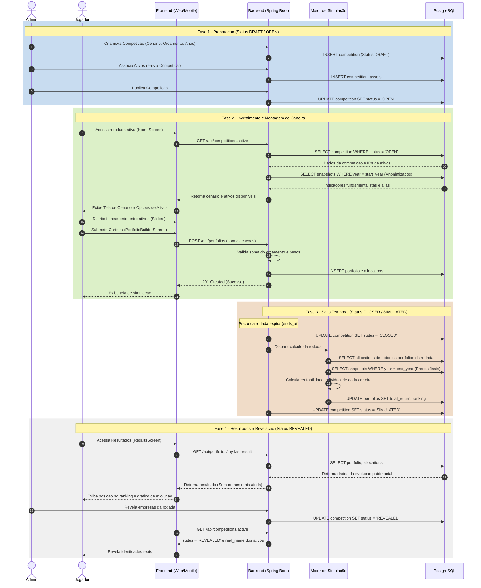

> [!NOTE]
> **Escopo do Diagrama**: Este diagrama representa a **arquitetura-alvo planejada** para a integração fim a fim do RetroBolsa. 
> 
> * **Já Implementado no Código**: Estrutura física de banco de dados (`V1`, `V2`, `V3`), fluxo completo de autenticação e sessão JWT, entidades JPA (`Competition`, `Portfolio`, `Allocation`, `Asset`), motor de simulação Java (`SimulationEngine`) e controllers REST (`CompetitionController`, `PortfolioController`).
> * **O Que Falta Conectar**: Alterar as chamadas no frontend de `mockData.ts` para consumirem os endpoints REST que já estão prontos na API Spring Boot.

Abaixo está o diagrama de sequência (UML comportamental) que ilustra o fluxo completo de interação entre os atores e os componentes do sistema durante o ciclo de vida de uma rodada de investimentos.

