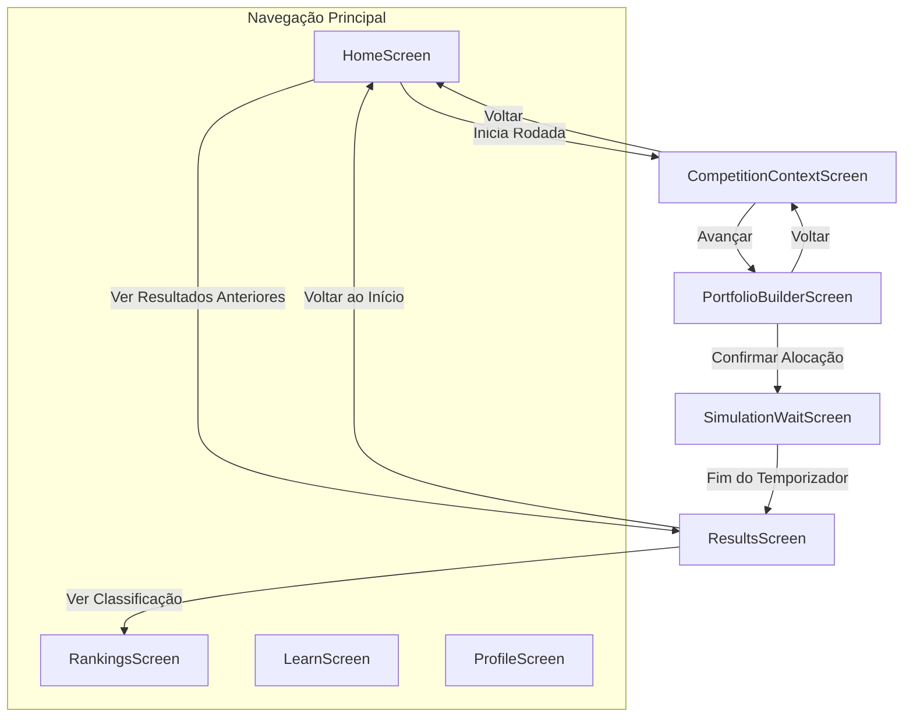

# Documentação e Análise Técnica — RetroBolsa App (Frontend)

Esta documentação apresenta uma análise detalhada da arquitetura, estrutura de componentes, fluxo de telas e estado atual do desenvolvimento do cliente (frontend) do ecossistema **RetroBolsa**, comercialmente intitulado **Cartola Financeiro**.

---

## 1. Visão Geral do Sistema Client-Side

O repositório do frontend (**retrobolsa-app**) é estruturado de forma híbrida, contendo duas plataformas distintas para a experiência do usuário:

1.  **Aplicação Web**: Desenvolvida com **React 18**, **Vite 6** e o novíssimo **Tailwind CSS v4** (com compilador nativo para Vite).
2.  **Aplicação Mobile**: Desenvolvida com **React Native** utilizando a plataforma **Expo v56** e **TypeScript**.

Ambas as aplicações compartilham a mesma identidade visual, conjuntos de dados fictícios para simulação e lógica de fluxo de telas, atuando como o simulador histórico de investimentos "Cartola Financeiro".

---

## 2. Plataforma Web: Tecnologias e Design System

As dependências declaradas no [package.json](file:///c:/Users/sembl/dev/Fetin%20-%20RetroBolsa/retrobolsa-app/package.json) revelam um ecossistema moderno e focado em alta fidelidade de design (exportado via Figma):

*   **Vite 6 & React 18 & TypeScript**: Infraestrutura leve e de alto desempenho para build e execução.
*   **Tailwind CSS v4.1.12**: Utiliza as novas diretivas do Tailwind v4 (`@tailwindcss/vite` nas devDependencies e definição do tema inline diretamente no arquivo CSS através de variáveis de cores e variáveis OKLCH).
*   **Design System & Componentes**:
    *   `@radix-ui/react-*`: Primitivos acessíveis que servem de base para os componentes visuais (padrão shadcn/ui).
    *   `@mui/material` (Material UI v7) + `@emotion/react` & `@emotion/styled`: Utilizado para componentes específicos de Grid ou layouts avançados.
    *   `lucide-react`: Biblioteca rica de ícones vetoriais.
*   **Gráficos & Animações**:
    *   `recharts`: Usado para plotar o gráfico interativo de rentabilidade histórica no final da simulação.
    *   `motion` (Framer Motion v12): Responsável por micro-interações de transição de telas e feedback visual.
*   **Validação & Toasts**:
    *   `react-hook-form`: Estrutura otimizada para validação de formulários.
    *   `sonner`: Sistema elegante de notificações em toast.

---

## 3. Plataforma Mobile: Tecnologias e Configuração

Localizada na pasta `/mobile`, a aplicação móvel é construída sobre:

*   **Expo v56 & React Native 0.85**: Suporte robusto para compilação multiplataforma (Android, iOS e Web).
*   **Renderização Gráfica**:
    *   `react-native-svg`: Utilizado para renderizar componentes vetoriais customizados e ícones complexos.
    *   `react-native-web`: Habilita a execução da aplicação mobile no navegador para testes rápidos.
*   **Ícones**:
    *   `lucide-react-native`: Versão otimizada da biblioteca de ícones para o React Native.

---

## 4. Estrutura de Pastas e Componentes

### 4.1. Estrutura Web (`retrobolsa-app/`)
```text
retrobolsa-app/
├── .env                                 # Variáveis de ambiente (VITE_API_URL apontando para o backend)
├── src/
│   ├── main.tsx                         # Renderização na DOM (React 18)
│   ├── app/
│   │   ├── App.tsx                      # Orquestrador de telas Web e inicialização do AuthProvider
│   │   ├── Attributions.md              # Créditos de fotos e bibliotecas
│   │   ├── types/
│   │   │   └── index.ts                 # Interfaces TypeScript (Asset, Competition, User, etc.)
│   │   ├── data/
│   │   │   └── mockData.ts              # Massa de dados de testes para rodadas e rankings
│   │   ├── contexts/
│   │   │   └── AuthContext.tsx          # Provedor global de estado de autenticação (JWT, usuário, carregamento)
│   │   ├── services/                    # Camada de Comunicação com a API (Axios e Serviços de Domínio)
│   │   │   ├── api.ts                   # Cliente Axios centralizado com interceptores de JWT e expiração
│   │   │   ├── authService.ts           # Endpoints de Autenticação (Login, Register) e gerenciamento de storage
│   │   │   ├── articleService.ts        # Métodos para leitura e progresso de artigos e lições
│   │   │   ├── competitionService.ts    # Métodos para rodadas de competição
│   │   │   ├── portfolioService.ts      # Métodos para simulação e carteiras
│   │   │   ├── rankingService.ts        # Métodos para rankings (quinzenal, geral, temporada)
│   │   │   └── userService.ts           # Métodos para perfil e score do usuário
│   │   └── components/                  # Componentes reutilizáveis
│   │       ├── AssetCard.tsx            # Exibe ativo anônimo com indicadores ou taxa
│   │       ├── CompetitionCard.tsx      # Exibe status da rodada ativa
│   │       ├── EconomicIndicatorCard.tsx# Exibe inflação, juros, PIB da rodada
│   │       ├── LessonCard.tsx           # Link para aulas específicas do Hub Educacional
│   │       ├── ModuleCard.tsx           # Progresso do módulo educacional
│   │       ├── RankingItem.tsx          # Linha de pontuação no ranking
│   │       ├── RentabilityChart.tsx     # Gráfico de evolução da carteira (Recharts)
│   │       ├── ui/                      # Sub-biblioteca baseada em shadcn/ui (58 componentes corrigidos)
│   │       └── screens/                 # Telas principais da aplicação
│   │           ├── LoginScreen.tsx      # Tela de login estilizada com validação e toasts (Nova)
│   │           ├── RegisterScreen.tsx   # Tela de registro com matching de senhas (Nova)
│   │           └── ... (HomeScreen, LearnScreen, etc.)
│   └── styles/
│       ├── index.css
│       ├── default_theme.css
│       └── globals.css                  # Definições do tema Tailwind CSS v4
```

### 4.2. Estrutura Mobile (`retrobolsa-app/mobile/`)
O projeto mobile reflete a mesma estrutura de telas e componentes lógicos adaptada para componentes nativos do React Native (`View`, `Text`, `StyleSheet`):
```text
mobile/
├── App.tsx                              # Orquestrador de telas Mobile (React Native SafeAreaView)
├── app.json                             # Configurações do Expo framework
├── components/
│   ├── Icon.tsx                         # Wrapper para ícones dinâmicos do Lucide
│   ├── ui/                              # Elementos customizados nativos
│   └── screens/                         # Telas convertidas em View nativas (HomeScreen, LearnScreen, etc.)
```

---

## 5. Fluxo de Experiência e Telas

O frontend (tanto Web quanto Mobile) implementa uma máquina de estados baseada no hook `useState<Screen>('home')`. O ciclo completo da experiência do usuário segue os passos descritos no diagrama abaixo:



### Detalhes de Cada Tela:

1.  **`HomeScreen` (Competir)**:
    *   Exibe a rodada ativa (Ex.: "Rodada 5").
    *   Apresenta um resumo "card" do último resultado obtido (posição, rentabilidade, valor final da carteira).
    *   Exibe o Top 5 geral da rodada anterior.
2.  **`LearnScreen` (Aprender)**:
    *   Funciona como um Hub Educacional.
    *   Apresenta módulos de aprendizado como *"Matemática Financeira"*, *"Fundamentos de Investimentos"* e *"Economia"*.
    *   Acompanha o progresso do aluno (ex.: "53% concluído").
    *   Lista aulas como *"O que é P/L?"*, *"O que é ROE?"* e *"Dividend Yield"*.
3.  **`RankingsScreen` (Classificações)**:
    *   Filtra os scores dos jogadores em três categorias: Rodada Quinzenal, Temporada e Ranking Geral Histórico.
    *   Destaca visualmente a linha correspondente ao usuário atual ("Você").
4.  **`ProfileScreen` (Perfil)**:
    *   Exibe o avatar customizado do jogador (gerado pela API Dicebear).
    *   Apresenta conquistas desbloqueadas (Badges como *"Primeira Competição"*, *"Top 10"*, *"Estudante Dedicado"* e bloqueadas como *"Campeão da Temporada"*).
5.  **`CompetitionContextScreen` (Cenário Econômico)**:
    *   Apresenta o contexto histórico da rodada antes do jogador investir.
    *   Exibe indicadores macroeconômicos chave: Taxa Básica de Juros, Inflação Anual, Crescimento do PIB e Taxa de Câmbio.
6.  **`PortfolioBuilderScreen` (Montagem de Carteira)**:
    *   **A grande mecânica do jogo**:
    *   O usuário possui um orçamento total de **R$ 100.000**.
    *   Lista de ativos dividida entre Ações Anônimas (*Empresa A, B, C, D, E* mostrando P/L, ROE, DY) e Títulos Públicos/Privados (*Título 1, 2, 3* mostrando taxa prefixada, IPCA ou Selic).
    *   Diálogo com **Slider interativo** para escolher o valor alocado em cada ativo.
    *   **Regra de validação local**: O usuário deve alocar pelo menos **50% do orçamento** (R$ 50.000) para ter o botão "Confirmar Carteira" habilitado. A barra superior atualiza dinamicamente o valor disponível.
7.  **`SimulationWaitScreen` (Execução)**:
    *   Gera uma animação e simula a passagem temporal e processamento da carteira pelo motor.
8.  **`ResultsScreen` (Feedback & Revelação)**:
    *   Apresenta a posição final da carteira no ranking.
    *   Mostra um **gráfico de linha** (`RentabilityChart`) exibindo a evolução do capital ano a ano (Ex.: R$ 100.000 escalando para R$ 250.000 ao longo de 2004 a 2011).
    *   **Momento Revelação**: Mostra quais eram as empresas reais por trás dos codinomes anônimos (Ex.: *"Empresa A"* revela-se *"Vale S.A."*; *"Título 1"* revela-se *"Tesouro Prefixado 2011"*).
    *   Traz uma explicação econômica resumindo por que aqueles ativos subiram ou caíram no período simulado.

---

## 6. Mapeamento de Dados de Simulação (Mock Data)

Toda a lógica está centrada no arquivo de tipos [types/index.ts](file:///c:/Users/sembl/dev/Fetin%20-%20RetroBolsa/retrobolsa-app/src/app/types/index.ts) e dados fictícios [mockData.ts](file:///c:/Users/sembl/dev/Fetin%20-%20RetroBolsa/retrobolsa-app/src/app/data/mockData.ts). 

Os contratos de dados frontend alinham-se perfeitamente com os atributos desenhados na modelagem física do banco de dados backend (`data_model.md`):

*   **`Asset`**: Contém nome anônimo, setor e indicadores no início da rodada, e recebe as propriedades `realName` e `bondType` na fase de resultados.
*   **`Competition`**: Contém o número da rodada (`round`), status (`open`, `closed`), dias restantes (`daysLeft`) e a lista de ativos concorrentes.
*   **`Result`**: Estrutura contendo o percentual final de rentabilidade (`rentability`), retorno anualizado e uma lista dos snapshots de valor do portfólio para plotagem do gráfico cartesiano.

---

## 7. Integração Web vs. Mobile e Estado de Acoplamento (Gargalos)

A integração técnica do frontend com o backend avançou significativamente através da conclusão da **Etapa 1 (Autenticação e Sessão)**.

> [!NOTE]
> **Integração de Autenticação Concluída** ✅:
> O frontend não é mais uma aplicação isolada. As telas de **Login (`LoginScreen`)** e **Cadastro (`RegisterScreen`)** estão totalmente funcionais e conectadas ao backend via Axios. O token JWT retornado pelo servidor é armazenado de forma segura em persistência de sessão e anexado a cada requisição HTTPS subsequente.

### Estado Atual dos Módulos:
1.  **Autenticação e Cadastro**:
    *   **100% Conectado** ✅: Formulários criados com `react-hook-form` e feedback instantâneo via toasts da biblioteca `sonner`.
    *   **Gestão de Sessão**: Implementada no `AuthContext` que carrega automaticamente o perfil e o token do `localStorage` ao abrir o app.
    *   **Segurança de Sessão**: Filtro de resposta configurado. Ao receber um erro `401 Unauthorized` do backend (token expirado ou inválido), a aplicação dispara um evento global `retrobolsa:session-expired` e redireciona automaticamente o usuário para a tela de login limpando o storage.
2.  **Competições e Ativos**:
    *   *Preparado (Mock)*: O serviço de consumo `competitionService.ts` foi criado e encapsula as assinaturas do backend. Atualmente as telas buscam dele, mas retornam a massa estática do mock até que o endpoint `GET /api/competitions/active` seja implementado no Spring Boot (Etapa 2).
3.  **Submissão de Portfólio**:
    *   *Preparado (Mock)*: O `portfolioService.ts` está desenhado e implementa o envio do JSON de alocação estruturado. A tela `PortfolioBuilderScreen` continuará com simulações locais até a criação do endpoint do backend.
4.  **Resultados e Rankings**:
    *   *Preparado (Mock)*: Serviços `rankingService.ts` e `articleService.ts` criados e integrados com a estrutura de tipos para facilitar a migração na Etapa 3.

---

## 8. Divergências e Oportunidades de Melhoria

Todos os problemas detectados na arquitetura de pacotes e infraestrutura do frontend foram corrigidos:

1.  **Duplicidade de Dependências no `package.json`**:
    *   *Estado*: **Corrigido e Resolvido** ✅
    *   *Resolução*: O arquivo `package.json` foi completamente limpo e reestruturado. Removidas as mais de 60 chaves duplicadas no formato pnpm. Adicionada a dependência oficial do `axios` e as tipagens de desenvolvimento correspondentes.
2.  **Resolução de Erro nos Imports dos Componentes Radix UI**:
    *   *Estado*: **Corrigido e Resolvido** ✅
    *   *Resolução*: Todos os 58 arquivos gerados pelo shadcn/ui em `components/ui/` possuíam imports versionados inválidos (ex: `from "@radix-ui/react-dialog@1.1.2"`), impossibilitando o build de produção via npm. Um script em PowerShell rodou em lote substituindo e padronizando os imports para o formato limpo (ex: `from "@radix-ui/react-dialog"`), permitindo que a aplicação seja empacotada com sucesso.
3.  **Validações com o Backend**:
    *   *Estado*: **Pendente de Resolução**
    *   *Detalhamento*: A validação de portfólio no frontend (`PortfolioBuilderScreen.tsx`) ainda permite o envio a partir de 50% de alocação de capital. É necessário alinhar se a regra final do backend validará a obrigatoriedade de 100% de alocação para rejeitar ou não chamadas com saldo restante em caixa.

---

## 9. Como Executar o Frontend Localmente

### 9.1. Rodando a Versão Web (React + Vite)
1.  Certifique-se de ter o Node.js instalado (v18 ou superior).
2.  Abra o terminal no diretório raiz do frontend (`retrobolsa-app`):
    ```bash
    npm install
    ```
    *(Ou use `pnpm install` caso prefira).*
3.  Inicie o servidor de desenvolvimento local:
    ```bash
    npm run dev
    ```
4.  O console fornecerá o link (geralmente `http://localhost:5173`) para acessar e visualizar a interface interativa no navegador.

### 9.2. Rodando a Versão Mobile (Expo React Native)
1.  No terminal, navegue até a pasta do aplicativo mobile:
    ```bash
    cd mobile
    ```
2.  Instale as dependências nativas e do Expo:
    ```bash
    npm install
    ```
3.  Inicie o empacotador Metro do Expo:
    ```bash
    npm run start
    ```
4.  Um QR Code será exibido no terminal:
    *   Escaneie-o com a câmera do seu smartphone (iOS) ou com o aplicativo **Expo Go** (Android) para abrir e testar o app em tempo real no seu aparelho físico.
    *   Alternativamente, digite `w` no terminal para abrir o simulador na versão Web.

---

## 10. Arquitetura da Camada de Comunicação (Axios & Sessão)

Abaixo descrevemos o fluxo técnico do controle de sessões e requisições HTTP introduzido na plataforma:

### 10.1. Cliente de API (`services/api.ts`)
O cliente Axios foi configurado para centralizar as requisições, automatizar a injeção do JWT no header das chamadas e monitorar tokens expirados:
*   **Request Interceptor**: Antes de cada envio HTTP, o interceptor verifica se há um token JWT gravado com a chave `retrobolsa_token` e, caso positivo, adiciona no cabeçalho: `Authorization: Bearer <token>`.
*   **Response Interceptor (Auto-Logout)**: Monitora todas as respostas da API. Se o servidor retornar o status `401 Unauthorized` (ex: expiração de sessão do JWT), ele limpa os dados do storage local e emite o evento global do navegador `"retrobolsa:session-expired"`.

### 10.2. Gerenciador de Autenticação (`contexts/AuthContext.tsx`)
A árvore do React é encapsulada pelo `AuthProvider`, fornecendo acesso global ao contexto da sessão através do hook `useAuth()`. Ele é encarregado de:
1.  Verificar o storage na inicialização da página para restaurar sessões existentes sem exigir novo login do usuário.
2.  Ouvir o evento `"retrobolsa:session-expired"`. Quando acionado, atualiza o estado global de usuário para `null` e direciona instantaneamente o fluxo de telas de volta para a tela de login, exibindo um toast descritivo ao usuário informando que a sessão expirou por segurança.

---

*Documentação elaborada para suporte e planejamento de integrações do ecossistema RetroBolsa.*
