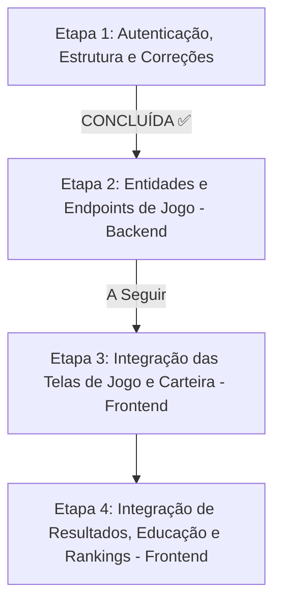

# Plano de Integração — Conexão Frontend & Backend (RetroBolsa)

Este documento atesta que **o frontend atualmente não está conectado com o backend**. Ambas as plataformas (Web e Mobile) operam de forma isolada, alimentando-se exclusivamente de dados simulados em `mockData.ts`. 

Abaixo, detalhamos o diagnóstico do que foi encontrado em cada extremidade e o roteiro estruturado com o que falta fazer para conectá-los.

## 1. Diagnóstico do Estado Atual

### 1.1. Estado do Frontend (Web & Mobile)
*   **Autenticação Integrada** ✅: As telas de `LoginScreen` e `RegisterScreen` estão concluídas e integradas à API via Axios. A sessão (JWT) é gerenciada no `AuthContext` e armazenada de forma persistente.
*   **Camada de Serviços Desenvolvida** ✅: O diretório `src/app/services/` foi povoado com classes de serviços para todas as entidades de jogo (`competitionService`, `portfolioService`, `rankingService`, `articleService`, `userService`). Eles se comunicam com a instância central do Axios (`api.ts`), prontos para apontar para os endpoints dinâmicos na Etapa 3.
*   **Dados de Jogo Mockados**: A aplicação consome a massa de testes de `mockData.ts` temporariamente, mas já realiza a ponte estrutural através da nova camada de serviços.
*   **Build de Produção e Dependências Estabilizadas** ✅: O manifesto `package.json` foi limpo (remoção de mais de 60 dependências duplicadas do pnpm) e erros de imports versionados do Radix UI corrigidos em todos os 58 componentes de interface.

### 1.2. Estado do Backend (Spring Boot)
*   **Autenticação e DTO de Resposta Corrigidos** ✅: O endpoint `/api/auth/login` agora retorna o DTO estruturado `AuthResponse` em JSON (contendo token, tipo e milissegundos para expiração).
*   **Estrutura de Validações Aperfeiçoada** ✅: O handler de exceções intercepta e formata erros do Bean Validation de forma limpa. A inconsistência de validação de tamanho mínimo de senha no `LoginRequest` foi corrigida para `@Size(min = 8)`.
*   **CORS Atualizado** ✅: Autorizada a comunicação cruzada com `http://localhost:5173` (Vite) e `http://localhost:19006` (Expo Web).
*   **Banco de Dados de Simulação Pronto** ✅: Criada a migração estrutural `V2__create_game_tables.sql` (tabelas de ativos, snapshots fundamentalistas, rodadas, alocações, carteiras, módulos educativos, progresso do aluno) e seeded em `V3__seed_initial_data.sql` com dados históricos reais da Rodada 1 (Brasil 2004-2011) e do Hub Educacional.
*   **Entidades JPA e Controllers Pendentes**: A modelagem de classes Spring (Entities, Repositories, Services e Controllers) correspondentes às tabelas da migração V2 e V3 será desenvolvida na **Etapa 2**.

---

## 2. Roteiro e Cronograma de Conexão (Atualizado)

---

### ETAPA 1: Autenticação, Correções e Estrutura (CONCLUÍDA ✅)

Esta etapa preparou a fundação de segurança e conectividade do ecossistema e resolveu gargalos graves de build e CORS:

#### Backend (Spring Boot) - Modificações Concluídas:
*   [x] **Configuração de CORS (`CorsConfig.java`)**: Portas de desenvolvimento `:5173` (Vite) e `:19006` (Expo Web) adicionadas às origens permitidas; autorizados métodos `GET`, `POST`, `PUT`, `DELETE`, `PATCH` e `OPTIONS`.
*   [x] **Correção de Senha Mínima (`LoginRequest.java`)**: Parâmetro `min` de validação de senha ajustado para `8`, garantindo simetria perfeita com o cadastro.
*   [x] **DTO de Resposta de Login (`AuthResponse.java` & `AuthController.java`)**: Resposta do login alterada de texto simples para JSON estruturado contendo dados adicionais e expiração em milissegundos (`expiresIn`).
*   [x] **Mensagens de Validação Amigáveis (`GlobalExceptionHandler.java`)**: Exceções de campos inválidos de payloads REST agora retornam uma lista limpa contendo o par `campo` e `mensagem`.
*   [x] **Cálculo de Expiração (`JwtUtil.java`)**: Novo método `getExpirationMs()` exposto para enviar dinamicamente o tempo restante da sessão.
*   [x] **Flyway Migrations (`V2` & `V3`)**: Banco de dados estruturado e populado na inicialização com cenários históricos reais de ativos, indicadores fundamentalistas anuais, artigos teóricos e lições.

#### Frontend (React / Vite) - Modificações Concluídas:
*   [x] **Resolução do Manifesto (`package.json`)**: Higienização completa removendo chaves redundantes e instalando dependências necessárias (`axios` e tipagens de desenvolvimento).
*   [x] **Correção em Lote do Radix UI**: Correção de imports versionados (`from "@radix-ui/react-X@1.x.x"`) em 58 componentes shadcn/ui do diretório `components/ui/`, permitindo o empacotamento (`npm run build`).
*   [x] **Cliente de API (`services/api.ts`)**: Configuração do cliente Axios centralizado, contendo interceptores automáticos de injeção de token e auto-logout com emissão de evento em caso de erro `401 Unauthorized`.
*   [x] **Telas de Autenticação (`LoginScreen` & `RegisterScreen`)**: Criados formulários funcionais em glassmorphism com validação robusta local (`react-hook-form`) e notificações toast (`sonner`).
*   [x] **Gerenciador de Contexto (`contexts/AuthContext.tsx`)**: Monitoramento de estado global de sessão de usuário com escuta de auto-logout e restauração automática do storage local.
*   [x] **Camada de Serviços (Services)**: Desenvolvida a assinatura de métodos de consumo REST de todos os recursos de jogo (`competitionService`, `portfolioService`, `rankingService`, `articleService`, `userService`).

---

### ETAPA 2: Desenvolvimento de Entidades e Endpoints (No Backend)

O foco agora é mapear as tabelas físicas criadas na migração `V2/V3` em classes Spring Boot JPA e expor as rotas correspondentes que o frontend já está mapeado para consumir:

1.  **Entidades JPA e Repositórios**:
    *   Mapear `Asset.java`, `AssetSnapshot.java`, `Competition.java`, `Portfolio.java`, `Allocation.java`, `Module.java`, `Article.java` e `UserArticleProgress.java`.
2.  **Controller de Competitividade (`GET /api/competitions/active`)**:
    *   Retorna a rodada com status `'open'`, dados macroeconômicos e ativos relacionados.
3.  **Controller de Portfólio (`POST /api/portfolios` & `GET /api/portfolios/my-last-result`)**:
    *   Valida a soma das alocações e orçamento, processa a rentabilidade com base nos snapshots e gera o resultado histórico final para o gráfico.
4.  **Controller de Educação (`GET /api/articles` & `POST /api/articles/{id}/complete`)**:
    *   Gerencia os artigos e o progresso individual dos alunos na trilha financeira.
5.  **Controller de Rankings (`GET /api/rankings`)**:
    *   Retorna listas parciais/totais para a tela de classificação.
6.  **Segurança (`SecurityConfig.java`)**:
    *   Configurar a liberação e restrição de rotas seguras que exigirão a presença do cabeçalho JWT do usuário.

---

### ETAPA 3: Integração das Telas do Simulador (Frontend)

Consiste em plugar a nova camada de serviços (Services) nas telas de simulação substituindo as chamadas de mock:

1.  **Tela Inicial (`HomeScreen`)**:
    *   Carregar rodada ativa através de `competitionService.getActive()`.
2.  **Cenário (`CompetitionContextScreen`)**:
    *   Obter a rodada detalhada na API.
3.  **Montagem de Carteira (`PortfolioBuilderScreen`)**:
    *   Carregar ativos da rodada e disparar `portfolioService.submit(...)` ao concluir, tratando possíveis erros de saldo de validação.
4.  **Tela de Espera (`SimulationWaitScreen`)**:
    *   Carregar `portfolioService.getLastResult()` do backend e conduzir à tela de revelação.

---

### ETAPA 4: Integração de Resultados, Educação e Rankings (Frontend)

1.  **Resultados (`ResultsScreen`)**:
    *   Plotar dinamicamente no `RentabilityChart` a evolução de capital real enviada pelo backend.
    *   Revelar tickers e nomes originais das empresas anonimizadas (`revealedAssets`).
2.  **Hub Educacional (`LearnScreen`)**:
    *   Carregar lições e registrar progresso do aluno acionando `articleService.complete(id)`.
3.  **Perfil e Classificação (`ProfileScreen` & `RankingsScreen`)**:
    *   Carregar foto de perfil (DiceBear baseada no username do JWT), conquistas desbloqueadas e dados classificatórios atrelados à API do ranking.

---

## 3. Correções Sistêmicas Adicionais Efetuadas

Durante a execução da Etapa 1, identificou-se que o frontend estava inutilizável em ambientes de build normais sem pnpm:
*   **Limpeza do Manifesto**: O excesso de chaves duplicadas no `package.json` gerava lentidão e alertas graves de segurança no NPM. O manifesto foi reestruturado e limpo para o formato padrão React/Vite.
*   **Correção em Lote de Componentes**: A substituição em lote dos imports `@radix-ui/react-X@1.x.x` permitiu que a pasta `retrobolsa-app/src/app/components/ui/` compilasse normalmente através do comando `npm run build`, sanando o gargalo estrutural mais crítico do frontend.

---

*Roadmap atualizado para refletir o andamento do projeto RetroBolsa.*
